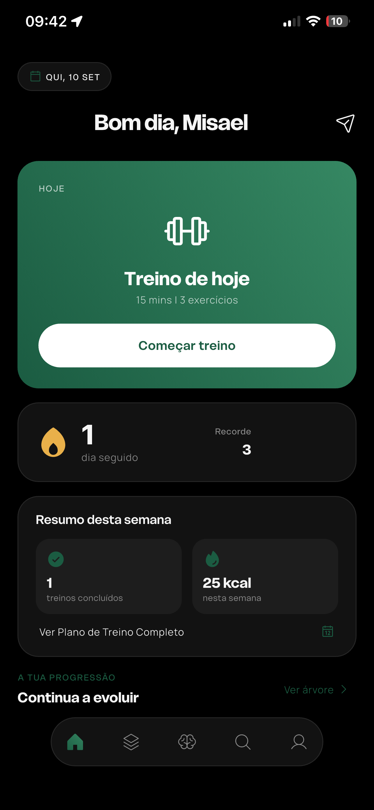
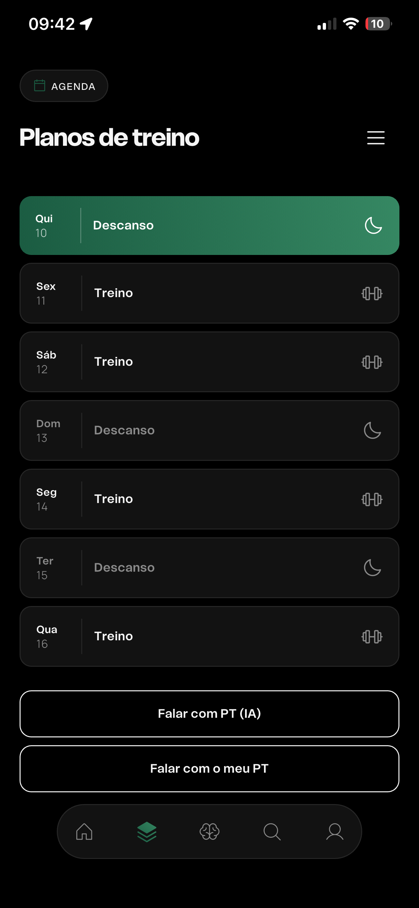
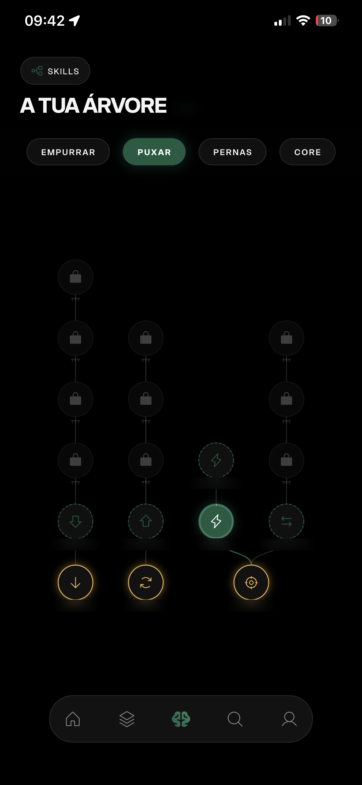
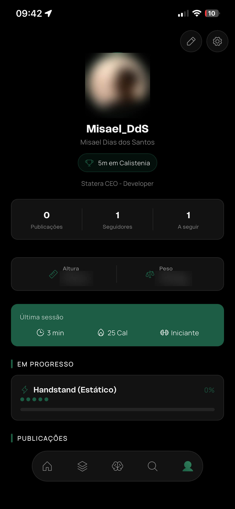

<p align="center">
  
</p>

<h1 align="center">STATERA</h1>

<p align="center">
  Calisthenics training app — plan, execute, progress.<br>
  Flutter · Supabase · on-device computer vision · LLM coaching
</p>

<p align="center">
  
  
  
  
  
</p>

---

## About

STATERA takes a user from a training plan, through the workout itself, to long-term
progression — three things that usually live in three separate apps.

The feature list below is deliberately high level. Details of the product design are
not public while the app is pre-launch.

It ships as a single Flutter codebase (Android, iOS, Web, desktop) on a Supabase backend,
with an on-device pose model assisting rep counting and an LLM coach built on Edge Functions.

> **Note** — this repository is a showcase. The product source code is private.

---

## Screens

<sub>Interface in European Portuguese — the product ships PT-first.</sub>

| Home | Schedule |
|:---:|:---:|
|  |  |
| Today's session, streak, weekly summary | Full plan calendar, per-day detail |

| Skill tree | Profile |
|:---:|:---:|
|  |  |
| Skill progression by path and state | Stats, skills and current progression |

## Demos

| | |
|:---|:---|
| **Camera rep counting** | Pose detection assists set counting during a workout — https://github.com/user-attachments/assets/cb87a740-ff03-4267-bb80-bac9a0e20c87 |
| **AI coach** | Conversational coaching inside the app — https://github.com/user-attachments/assets/f48e4739-5c5d-4920-95e1-10482db1401a |

---

## Features

<table>
<tr>
<td width="60" align="center"></td>
<td><b>Multi-week training plans</b><br>Structured plans that fill the calendar day by day.</td>
</tr>
<tr>
<td align="center"></td>
<td><b>Guided workout player</b><br>Set-by-set execution with rep and timed modes and automatic rest.</td>
</tr>
<tr>
<td align="center"></td>
<td><b>Camera rep counting</b><br>On-device pose detection as an optional assist to manual counting. No video leaves the phone.</td>
</tr>
<tr>
<td align="center"></td>
<td><b>Calisthenics skill tree</b><br>Skills organised in progression paths, unlocked as training advances.</td>
</tr>
<tr>
<td align="center"></td>
<td><b>AI coach</b><br>Conversational coaching grounded in the user's own training context. Usage-capped per user.</td>
</tr>
<tr>
<td align="center"></td>
<td><b>Progression tracking</b><br>Training streaks and session history over time.</td>
</tr>
<tr>
<td align="center"></td>
<td><b>Social layer</b><br>Profiles, follows and posts.</td>
</tr>
<tr>
<td align="center"></td>
<td><b>Privacy &amp; GDPR</b><br>Consent management, data export and deferred account deletion with a grace period.</td>
</tr>
</table>

---

## Tech stack

| Layer | Technology |
|---|---|
| App | Flutter / Dart — Android, iOS, Web, Windows, macOS, Linux |
| State | BLoC / Cubit (`flutter_bloc`), `equatable` |
| DI | GetIt |
| Backend | Supabase — Postgres 17, Auth, Storage, Realtime |
| Server logic | SQL functions (RPC) + Deno Edge Functions |
| AI | Anthropic Claude, called server-side |
| Computer vision | ML Kit pose detection + `camera`, running on-device |
| UI | Custom design system, Phosphor icons, Unbounded + Manrope |

## Architecture

Clean Architecture per feature, three layers each:

```
lib/
├── core/            theme tokens · DI · storage · utils
├── features/        auth · plans · workout · skills · profile · chat · ...
│   └── <feature>/
│       ├── data/         datasources · models · repositories
│       ├── domain/       entities · repository interfaces · use cases
│       └── presentation/ bloc · pages · widgets
└── shared/widgets/  primitives reused across 2+ features
```

Data flow: `Page → BLoC → UseCase → Repository → Datasource → Supabase`.

## Engineering notes

- **Row Level Security on every table** — authorisation lives in the database, not only in the client.
- **Composite operations as server-side RPCs** — a plan is written in one transaction instead of dozens of round-trips.
- **Zero import cycles** across ~280 files / 2.8k graph nodes; layer separation holds in practice, not just in folder names.
- **Design system as single source of truth** — no hex literals, no inline font sizes, no magic spacing in UI code; a component gallery renders every shared widget at 320px and text scale 1.6.
- **Local-first reads** with cache fallback, so the app opens on a flaky connection.
- **AI cost control** — daily token ceilings, request caps and bounded history per user.
- **On-device inference** — pose frames are processed locally and never uploaded.

---

## Contact

**Misael Santos** · [misael.dias.santos@gmail.com](mailto:misael.dias.santos@gmail.com)

Source code available for review on request.
